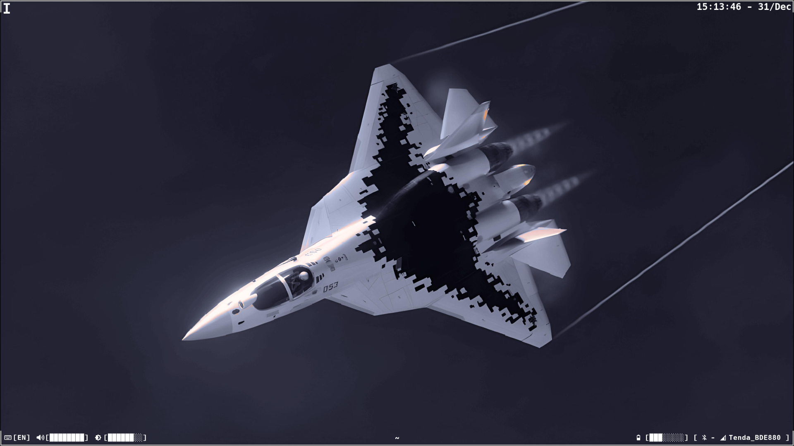
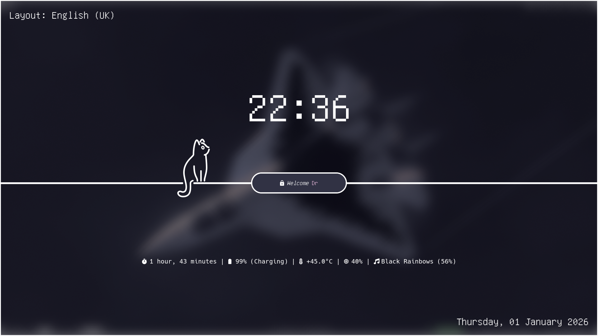
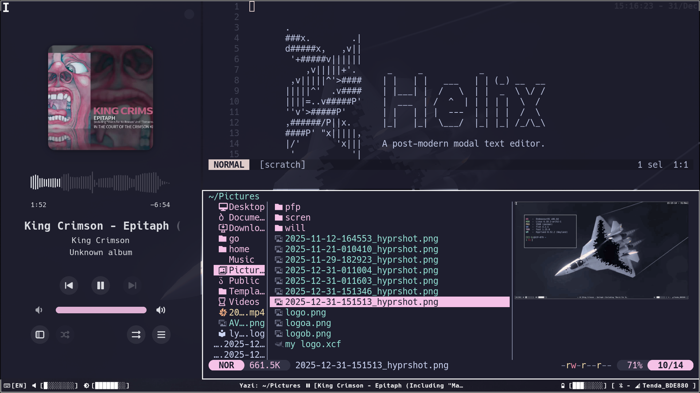

# 🐧 [Ice-day Rice]

## 📸 Screenshots
<p align="center">
  
  
</p>
<p align="center">
  
  
</p>

## 🛠 Details
| Component | Software |
| --- | --- |
| **OS** | EndeavourOS |
| **WM / DE** | Hyprland |
| **Terminal** | Foot |
| **Shell** | fish |
| **Bar** | Eww |
| **Theme** | Catppuccin |

## 🚀 Installation
1. **Clone the repo:**
   ```bash
   git clone [https://github.com/Mr-hero1/My-Config.git](https://github.com/Mr-hero1/My-Config.git)
   cd My-Config
