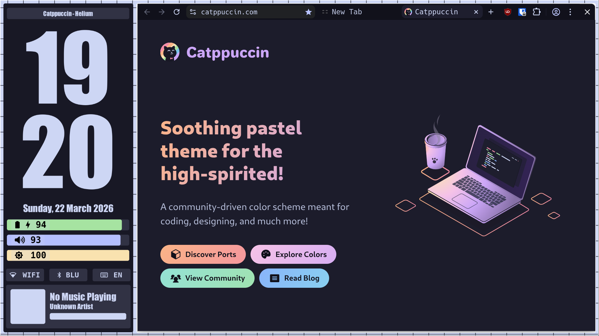
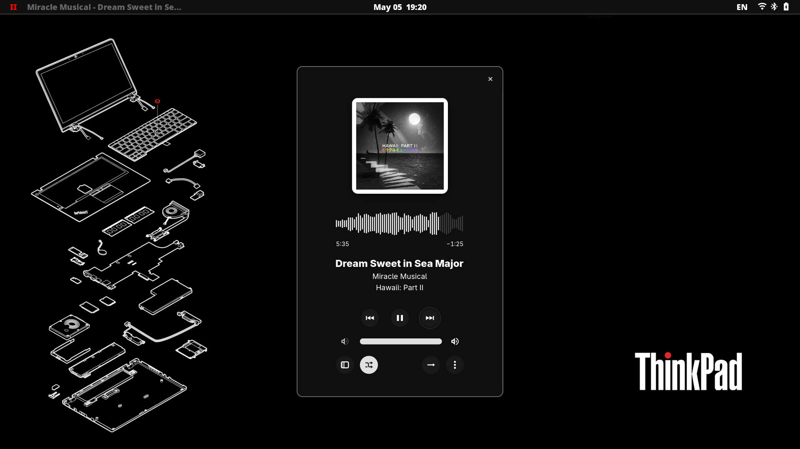
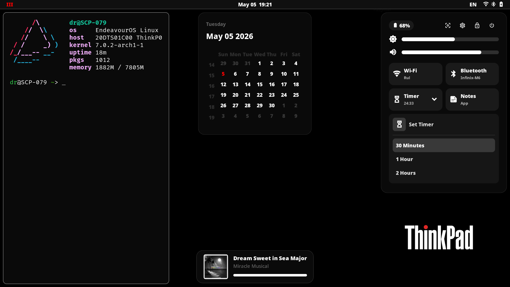
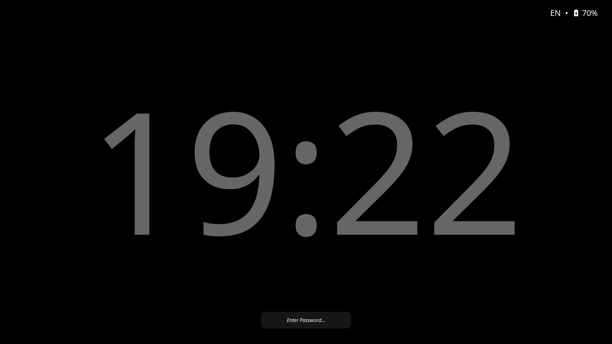

# 🐧 [Nightly Rice]
Personal dotfiles for Hyprland configuration.

## 📸 Screenshots
<p align="center">
  
  
</p>
<p align="center">
  
  
</p>

## 🛠 Details
| Component    | Software     |
|--------------|--------------|
| OS           | EndeavourOS  |
| WM / DE      | Hyprland     |
| Terminal     | Foot         |
| Shell        | fish         |
| Bar          | Eww          |
| Theme        | Catppuccin   |


## 🚀 Installation
1. **Clone the repo:**
   ```bash
   git clone https://github.com/Mr-hero1/My-Dotfiles.git
   cd My-Dotfiles
   
## 🤓 References & Themes
- Fausto-Korpsvart / Catppuccin GTK Theme  
  - URL: https://github.com/Fausto-Korpsvart/Catppuccin-GTK-Theme  

- catppuccin / qtcreator  
  - URL: https://github.com/catppuccin/qtcreator

-  Catppuccin / Kvantum
  - URL: https://github.com/catppuccin/Kvantum
    
- eww configuration docs (official)  
  - URL: https://elkowar.github.io/eww/configuration.html
