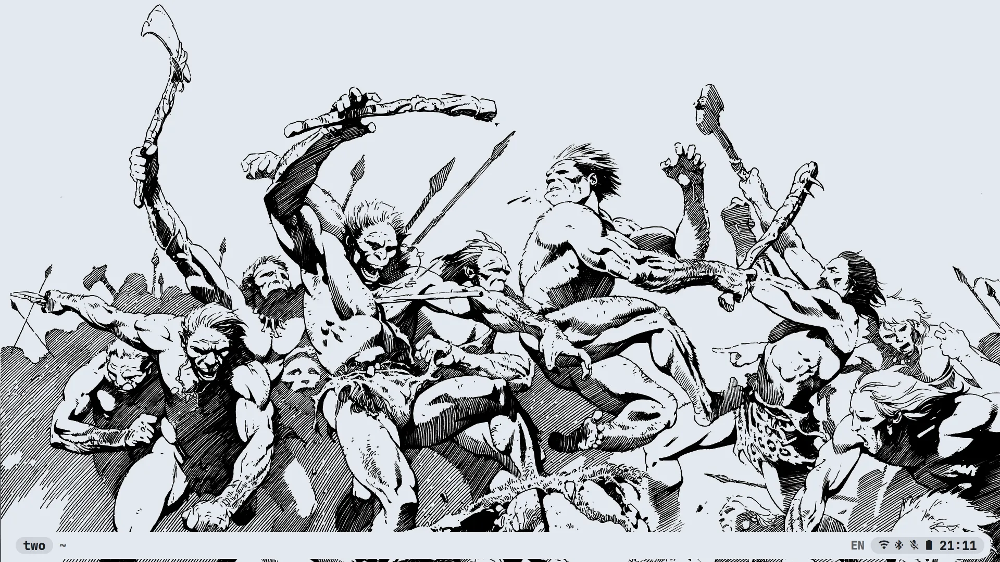
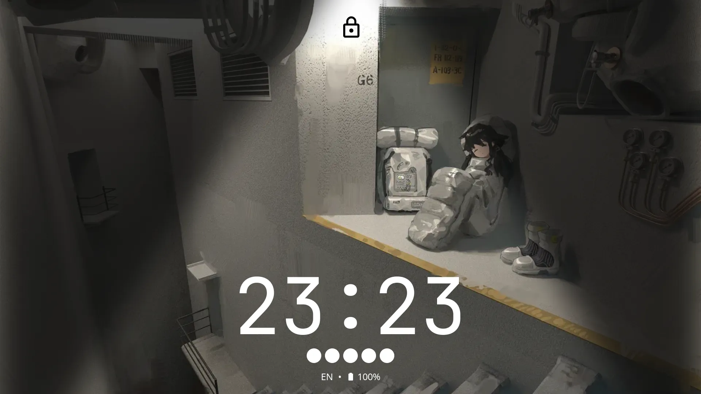
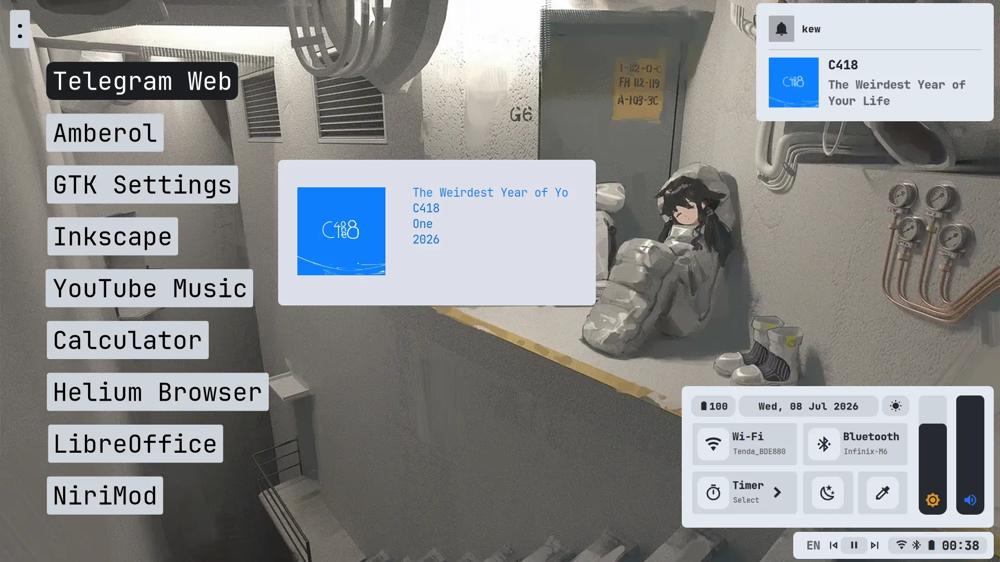
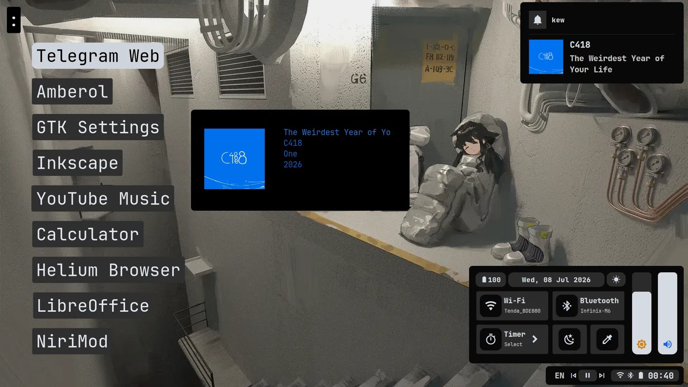
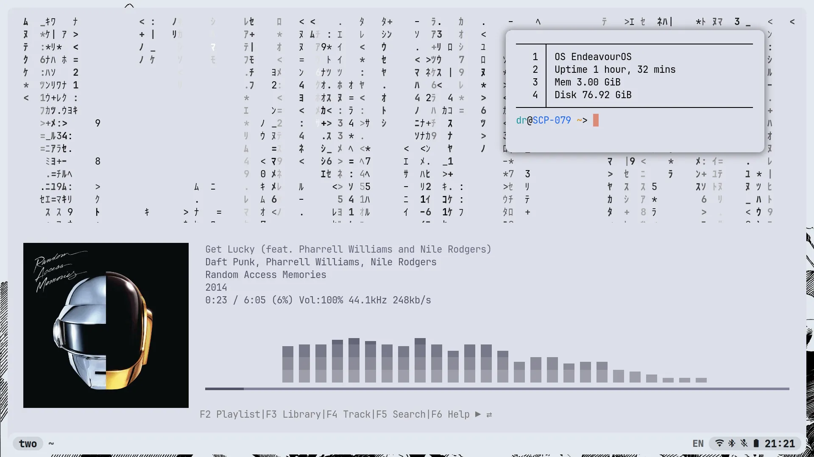
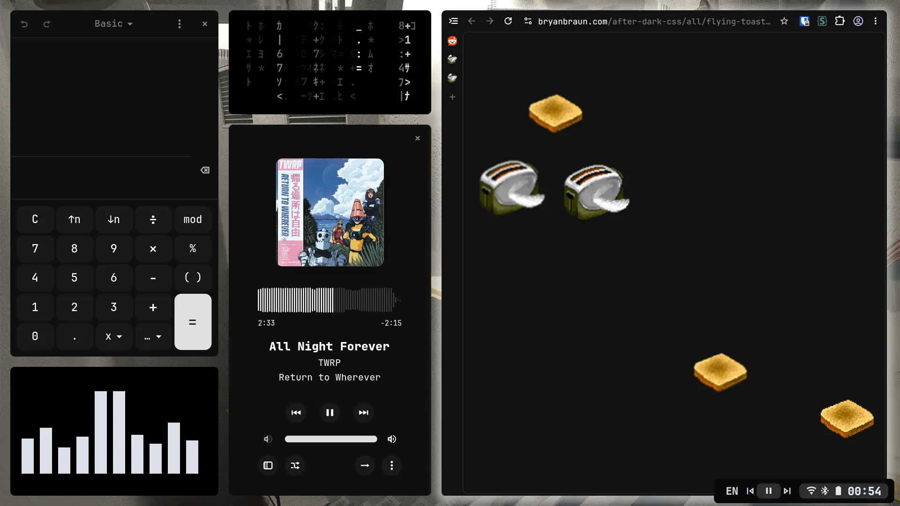

# [NIRI Rice]
Personal dotfiles for Niri configuration.
> [!NOTE]
>  you may need to adjust the scripts and Eww configuration for the widgets to work. good luck! ;)

<b>Desktop & Hyprlock </b>

 

  
  

<b>UI Elements & Menus</b>

 

  
  

<b>Workflow</b>

 

  
  

## Details
| Component | Software |
| :--- | :--- |
| **OS** | EndeavourOS |
| **Window Manager** | Niri |
| **Status Bar & Widgets** | Eww |
| **Terminal Emulator** | Foot |
| **User Shell** | Fish |
| **Text Editor** | Helix |
   
## References & Themes
- Graphite-gtk-theme: dark mod (Graphite-Dark)
  - URL:  https://github.com/vinceliuice/Graphite-gtk-theme/tree/main
- Tela-circle-icon-theme: dark and light mod (Tela-circle-black-dark/Tela-circle-black-light)
  - URL:  https://github.com/vinceliuice/Tela-circle-icon-theme
- Catppuccin-GTK-Them: light theme (Catppuccin-Light)
  - URL: https://github.com/Fausto-Korpsvart/Catppuccin-GTK-Theme  
- eww configuration docs
  - URL: https://elkowar.github.io/eww/configuration.html
